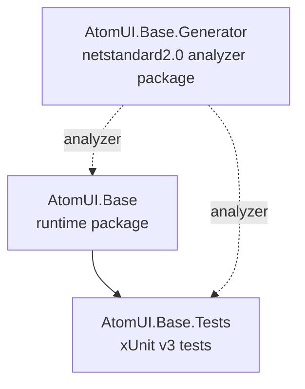

# Dependency Graph

This document records the first-version AtomUI.Base project dependency rules.

## Rules

- `AtomUI.Base.Generator` must stay independent of `AtomUI.Base`.
- `AtomUI.Base` consumes `AtomUI.Base.Generator` with `OutputItemType="Analyzer"` and `ReferenceOutputAssembly="false"`.
- Test projects may reference runtime projects normally and generator projects as analyzers.
