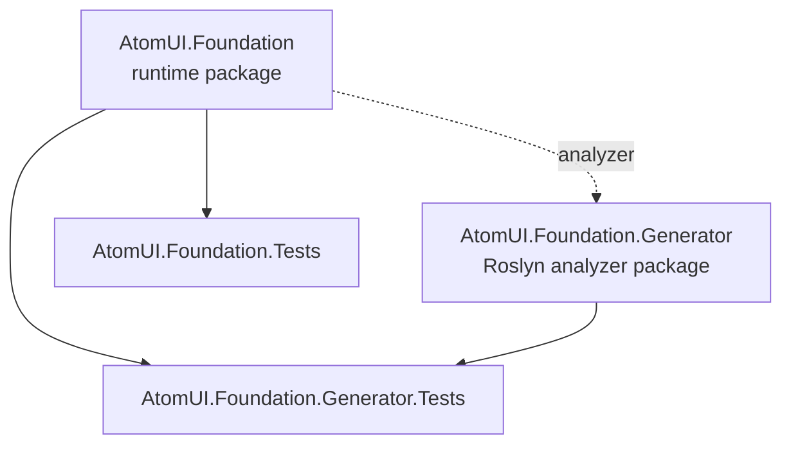

# Dependency Graph

AtomUI.Foundation has two package projects and two test projects. The runtime package owns public modularity primitives; the generator package is consumed only as a Roslyn analyzer.

## Rules

- `AtomUI.Foundation` may reference `AtomUI.Foundation.Generator` only as an analyzer with `ReferenceOutputAssembly="false"`.
- `AtomUI.Foundation.Generator` must not reference `AtomUI.Foundation`.
- Tests may reference the runtime package and, for generator coverage, the generator package.
- Generator package dependencies stay private with `PrivateAssets="all"`.
