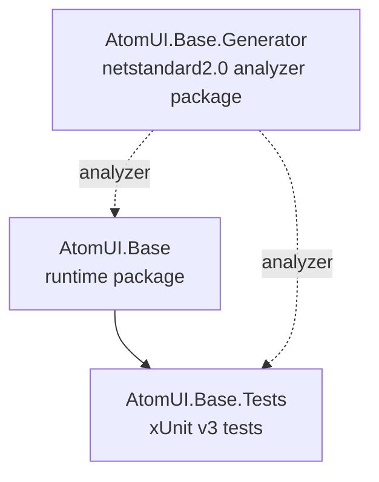

# AtomUI.Base Project Structure Implementation Plan

> **For agentic workers:** REQUIRED SUB-SKILL: Use superpowers:subagent-driven-development (recommended) or superpowers:executing-plans to implement this plan task-by-task. Steps use checkbox (`- [ ]`) syntax for tracking.

**Goal:** Create the first complete AtomUI.Base repository skeleton with AtomUIV6-style build configuration, projects, tests, docs, local agent skills, and NuGet release workflow.

**Architecture:** The repository uses lightweight root MSBuild files that import focused props from `build/`. Source code is split into a runtime package (`AtomUI.Base`) and an analyzer package skeleton (`AtomUI.Base.Generator`), with tests under `tests/` and documentation under `docs/`. Project-local workflow helpers live under `.agents/skills`, while GitHub Actions release automation lives under `.github/workflows`.

**Tech Stack:** .NET SDK 10.0.300, C# latest, MSBuild, Central Package Management, xUnit v3, Shouldly, Roslyn analyzer packaging, GitHub Actions.

---

## File Structure

- Create `.editorconfig`: repository line-ending defaults.
- Create `.gitignore`: ignore IDE files, build outputs, generated outputs, local NuGet feeds, and `docs/superpowers/specs`.
- Create `global.json`: pin .NET SDK.
- Create `Directory.Build.props`: root MSBuild entry importing `build/*.props`.
- Create `Directory.Build.targets`: remove `*.csproj.DotSettings` items.
- Create `Directory.Packages.props`: centrally manage NuGet versions.
- Create `AtomUI.Base.slnx`: solution file for the three first-version projects.
- Create `build/Version.props`: version constants.
- Create `build/Common.props`: shared target framework and warning configuration.
- Create `build/PackageMetaInfo.props`: NuGet metadata.
- Create `build/Output.props`: output path routing.
- Create `resources/.gitkeep`: preserve empty resources folder.
- Create `src/AtomUI.Base/AtomUI.Base.csproj`: runtime package project.
- Create `src/AtomUI.Base/BaseAssemblyMarker.cs`: public marker type.
- Create `src/AtomUI.Base.Generator/AtomUI.Base.Generator.csproj`: analyzer package skeleton.
- Create `src/AtomUI.Base.Generator/AtomUIBaseGeneratorMarker.cs`: internal generator assembly marker.
- Create `tests/AtomUI.Base.Tests/AtomUI.Base.Tests.csproj`: test project.
- Create `tests/AtomUI.Base.Tests/BaseAssemblyMarkerTests.cs`: marker reference test.
- Create `AGENTS.md`: small global entry point.
- Create `docs/global-engineering-guidelines.md`: global engineering rules entry.
- Create `docs/architecture/overview.md`: project overview.
- Create `docs/architecture/build-and-packaging.md`: build and packaging rules.
- Create `docs/architecture/dependency-graph.md`: project dependency rules.
- Create `docs/engineering/agent-guidelines.md`: collaboration and verification rules.
- Create `docs/engineering/source-generator-guidelines.md`: generator constraints.
- Keep `docs/architecture/atomui-base-project-structure-design.md`: approved design reference.
- Create `.agents/skills/*`: AtomUI.Base workflow skills.
- Create `.github/workflows/release-atomui-base.yml`: NuGet release workflow.

### Task 1: Build System And Repository Shell

**Files:**
- Create: `.editorconfig`
- Create: `.gitignore`
- Create: `global.json`
- Create: `Directory.Build.props`
- Create: `Directory.Build.targets`
- Create: `Directory.Packages.props`
- Create: `AtomUI.Base.slnx`
- Create: `build/Version.props`
- Create: `build/Common.props`
- Create: `build/PackageMetaInfo.props`
- Create: `build/Output.props`
- Create: `resources/.gitkeep`

- [ ] **Step 1: Create repository configuration files**

Create `.editorconfig`:

```ini
root = true

[*]
end_of_line = lf
insert_final_newline = true
```

Create `.gitignore`:

```gitignore
*.suo
*.user
*.sln.docstates
.vs/
.idea/
*.DotSettings.user

[Dd]ebug/
[Rr]elease/
[Bb]in/
[Oo]bj/
output/
outputs/
artifacts/
nuget/
.nuget/

*.log
*.tmp
*.pdb
*.cache
*.pid

.DS_Store
Thumbs.db

GeneratedFiles/
docs/superpowers/specs/
```

Create `global.json`:

```json
{
  "sdk": {
    "version": "10.0.300",
    "rollForward": "latestFeature"
  }
}
```

- [ ] **Step 2: Create root MSBuild files**

Create `Directory.Build.props`:

```xml
<Project>

    <PropertyGroup>
        <Nullable>enable</Nullable>
        <ImplicitUsings>enable</ImplicitUsings>
        <LangVersion>latest</LangVersion>
    </PropertyGroup>

    <Import Project="$(MSBuildThisFileDirectory)/build/Version.props" />
    <Import Project="$(MSBuildThisFileDirectory)/build/Common.props" />
    <Import Project="$(MSBuildThisFileDirectory)/build/PackageMetaInfo.props" />
    <Import Project="$(MSBuildThisFileDirectory)/build/Output.props" />
</Project>
```

Create `Directory.Build.targets`:

```xml
<Project>

    <!-- https://github.com/dotnet/sdk/issues/22515 -->
    <ItemGroup>
        <None Remove="*.csproj.DotSettings" />
    </ItemGroup>
</Project>
```

Create `Directory.Packages.props`:

```xml
<Project>
    <PropertyGroup>
        <ManagePackageVersionsCentrally>true</ManagePackageVersionsCentrally>
    </PropertyGroup>

    <ItemGroup>
        <PackageVersion Include="Microsoft.CodeAnalysis.CSharp" Version="5.0.0" />
        <PackageVersion Include="Microsoft.CodeAnalysis.Analyzers" Version="5.3.0" />
        <PackageVersion Include="Microsoft.NET.Test.Sdk" Version="18.3.0" />
        <PackageVersion Include="Shouldly" Version="4.3.0" />
        <PackageVersion Include="xunit.v3" Version="3.2.2" />
        <PackageVersion Include="xunit.runner.visualstudio" Version="3.1.5" />
    </ItemGroup>
</Project>
```

- [ ] **Step 3: Create build props**

Create `build/Version.props`:

```xml
<Project>
    <PropertyGroup>
        <NoWarn>$(NoWarn);CS7035</NoWarn>
        <AtomUIBaseVersion>1.0.0-alpha.1</AtomUIBaseVersion>
    </PropertyGroup>
</Project>
```

Create `build/Common.props`:

```xml
<Project>
    <PropertyGroup>
        <AtomUIBaseDevelopTargetFramework>net10.0</AtomUIBaseDevelopTargetFramework>
        <AtomUIBaseProductionTargetFramework>net8.0</AtomUIBaseProductionTargetFramework>
        <OutputType>Library</OutputType>
        <TrimMode>copyused</TrimMode>
        <Configuration Condition="'$(Configuration)' == ''">Debug</Configuration>
        <BuiltInComInteropSupport>false</BuiltInComInteropSupport>

        <AtomUIBaseTargetFrameworks Condition=" '$(Configuration)' == 'Debug' ">$(AtomUIBaseDevelopTargetFramework)</AtomUIBaseTargetFrameworks>
        <AtomUIBaseTargetFrameworks Condition=" '$(Configuration)' == 'Release' ">$(AtomUIBaseDevelopTargetFramework);$(AtomUIBaseProductionTargetFramework)</AtomUIBaseTargetFrameworks>

        <IsTestProject Condition="$(MSBuildProjectFullPath.Contains('test')) and $(MSBuildProjectName.EndsWith('.Tests'))">true</IsTestProject>
        <AccelerateBuildsInVisualStudio>true</AccelerateBuildsInVisualStudio>
        <NoWarn>$(NoWarn);CS1591;CS0436;CS7035</NoWarn>
        <AllowedOutputExtensionsInPackageBuildOutputFolder>$(AllowedOutputExtensionsInPackageBuildOutputFolder);.pdb</AllowedOutputExtensionsInPackageBuildOutputFolder>
        <GenerateAssemblyConfigurationAttribute>true</GenerateAssemblyConfigurationAttribute>
        <GenerateAssemblyCompanyAttribute>true</GenerateAssemblyCompanyAttribute>
        <GenerateAssemblyProductAttribute>true</GenerateAssemblyProductAttribute>
        <WarningsAsErrors>Nullable</WarningsAsErrors>
    </PropertyGroup>
</Project>
```

Create `build/PackageMetaInfo.props`:

```xml
<Project>
    <PropertyGroup>
        <PackageId>$(MSBuildProjectName)</PackageId>
        <Title>AtomUI.Base</Title>
        <Author>Qinware Technologies Ltd.</Author>
        <Authors>$(Author)</Authors>
        <Description>AtomUI.Base provides foundational runtime and source-generation infrastructure for the AtomUI ecosystem.</Description>
        <PackageTags>AtomUI;UI;Infrastructure;SourceGenerator;Roslyn</PackageTags>
        <ProjectUrl>https://qinware.com</ProjectUrl>
        <RepositoryUrl>https://github.com/AtomUI/AtomUI.Base</RepositoryUrl>
        <Company>Qinware Technologies Ltd.</Company>
        <Copyright>Copyright ©2018-2026, Qinware Technologies Co.,Ltd., All Rights Reserved.</Copyright>
        <Version>$(AtomUIBaseVersion)</Version>
    </PropertyGroup>
</Project>
```

Create `build/Output.props`:

```xml
<Project>
    <PropertyGroup>
        <PackageOutputPath>$(MSBuildThisFileDirectory)../output/Nuget/$(Configuration)</PackageOutputPath>
        <OutputPathWithoutFramework>$(MSBuildThisFileDirectory)../output/bin/$(Configuration)</OutputPathWithoutFramework>
        <OutputPath>$(OutputPathWithoutFramework)</OutputPath>
        <BaseIntermediateOutputPath>$(MSBuildThisFileDirectory)../output/$(MSBuildProjectName)/obj</BaseIntermediateOutputPath>
        <IntermediateOutputPathWithoutFramework>$(BaseIntermediateOutputPath)</IntermediateOutputPathWithoutFramework>
        <IntermediateOutputPath>$(BaseIntermediateOutputPath)/$(Configuration)</IntermediateOutputPath>
    </PropertyGroup>
</Project>
```

- [ ] **Step 4: Create solution and resources placeholder**

Create `AtomUI.Base.slnx`:

```xml
<Solution>
  <Project Path="src/AtomUI.Base/AtomUI.Base.csproj" />
  <Project Path="src/AtomUI.Base.Generator/AtomUI.Base.Generator.csproj" />
  <Project Path="tests/AtomUI.Base.Tests/AtomUI.Base.Tests.csproj" />
</Solution>
```

Create `resources/.gitkeep` as an empty file.

- [ ] **Step 5: Commit build shell**

Run:

```bash
git add .editorconfig .gitignore global.json Directory.Build.props Directory.Build.targets Directory.Packages.props AtomUI.Base.slnx build resources
git commit -m "build: add AtomUI.Base repository build shell"
```

Expected: commit succeeds and `.idea/` remains unstaged.

### Task 2: Projects And Test Chain

**Files:**
- Create: `src/AtomUI.Base/AtomUI.Base.csproj`
- Create: `src/AtomUI.Base/BaseAssemblyMarker.cs`
- Create: `src/AtomUI.Base.Generator/AtomUI.Base.Generator.csproj`
- Create: `src/AtomUI.Base.Generator/AtomUIBaseGeneratorMarker.cs`
- Create: `tests/AtomUI.Base.Tests/AtomUI.Base.Tests.csproj`
- Create: `tests/AtomUI.Base.Tests/BaseAssemblyMarkerTests.cs`

- [ ] **Step 1: Create project files without runtime marker implementation**

Create `src/AtomUI.Base.Generator/AtomUI.Base.Generator.csproj`:

```xml
<Project Sdk="Microsoft.NET.Sdk"
         TreatAsLocalProperty="IsAotCompatible;EnableAotAnalyzer;EnableTrimAnalyzer;EnableSingleFileAnalyzer">

    <PropertyGroup>
        <TargetFramework>netstandard2.0</TargetFramework>
        <IsRoslynComponent>true</IsRoslynComponent>
        <EnforceExtendedAnalyzerRules>true</EnforceExtendedAnalyzerRules>
        <SuppressDependenciesWhenPacking>true</SuppressDependenciesWhenPacking>
        <IncludeBuildOutput>false</IncludeBuildOutput>
        <IncludeInPublish>false</IncludeInPublish>
        <IsAotCompatible>false</IsAotCompatible>
        <EnableAotAnalyzer>false</EnableAotAnalyzer>
        <EnableTrimAnalyzer>false</EnableTrimAnalyzer>
        <EnableSingleFileAnalyzer>false</EnableSingleFileAnalyzer>
    </PropertyGroup>

    <ItemGroup>
        <PackageReference Include="Microsoft.CodeAnalysis.CSharp" PrivateAssets="all" />
        <PackageReference Include="Microsoft.CodeAnalysis.Analyzers" PrivateAssets="all" />
    </ItemGroup>

    <ItemGroup>
        <None Include="$(OutputPath)/$(AssemblyName).dll" Pack="true" PackagePath="analyzers/dotnet/cs" Visible="false" />
    </ItemGroup>
</Project>
```

Create `src/AtomUI.Base.Generator/AtomUIBaseGeneratorMarker.cs`:

```csharp
namespace AtomUI.Base.Generator;

internal static class AtomUIBaseGeneratorMarker
{
    public const string AssemblyName = "AtomUI.Base.Generator";
}
```

Create `src/AtomUI.Base/AtomUI.Base.csproj`:

```xml
<Project Sdk="Microsoft.NET.Sdk">
    <PropertyGroup>
        <TargetFrameworks>$(AtomUIBaseTargetFrameworks)</TargetFrameworks>
        <RootNamespace>AtomUI.Base</RootNamespace>
    </PropertyGroup>

    <ItemGroup>
        <ProjectReference Include="../AtomUI.Base.Generator/AtomUI.Base.Generator.csproj"
                          OutputItemType="Analyzer"
                          ReferenceOutputAssembly="false"
                          PrivateAssets="all" />
    </ItemGroup>

    <ItemGroup>
        <AssemblyMetadata Include="AtomUIBaseVersion" Value="$(AtomUIBaseVersion)" />
    </ItemGroup>
</Project>
```

Create `tests/AtomUI.Base.Tests/AtomUI.Base.Tests.csproj`:

```xml
<Project Sdk="Microsoft.NET.Sdk">
    <PropertyGroup>
        <TargetFramework>net10.0</TargetFramework>
        <IsPackable>false</IsPackable>
        <RootNamespace>AtomUI.Base.Tests</RootNamespace>
    </PropertyGroup>

    <ItemGroup>
        <PackageReference Include="Microsoft.NET.Test.Sdk" />
        <PackageReference Include="Shouldly" />
        <PackageReference Include="xunit.v3" />
        <PackageReference Include="xunit.runner.visualstudio" PrivateAssets="all" />
    </ItemGroup>

    <ItemGroup>
        <ProjectReference Include="../../src/AtomUI.Base/AtomUI.Base.csproj" />
        <ProjectReference Include="../../src/AtomUI.Base.Generator/AtomUI.Base.Generator.csproj"
                          OutputItemType="Analyzer"
                          ReferenceOutputAssembly="false"
                          PrivateAssets="all" />
    </ItemGroup>
</Project>
```

- [ ] **Step 2: Write failing marker test**

Create `tests/AtomUI.Base.Tests/BaseAssemblyMarkerTests.cs`:

```csharp
using AtomUI.Base;
using Shouldly;
using Xunit;

namespace AtomUI.Base.Tests;

public sealed class BaseAssemblyMarkerTests
{
    [Fact]
    public void BaseAssemblyMarker_ShouldExposeAssemblyName()
    {
        BaseAssemblyMarker.AssemblyName.ShouldBe("AtomUI.Base");
    }
}
```

- [ ] **Step 3: Run test to verify it fails**

Run:

```bash
dotnet test tests/AtomUI.Base.Tests/AtomUI.Base.Tests.csproj --framework net10.0
```

Expected: fails with a compiler error that `BaseAssemblyMarker` does not exist.

- [ ] **Step 4: Add minimal runtime marker implementation**

Create `src/AtomUI.Base/BaseAssemblyMarker.cs`:

```csharp
namespace AtomUI.Base;

public static class BaseAssemblyMarker
{
    public const string AssemblyName = "AtomUI.Base";
}
```

- [ ] **Step 5: Run test to verify it passes**

Run:

```bash
dotnet test tests/AtomUI.Base.Tests/AtomUI.Base.Tests.csproj --framework net10.0
```

Expected: test run passes with `1` passed test and `0` failed tests.

- [ ] **Step 6: Commit projects and tests**

Run:

```bash
git add src tests
git commit -m "feat: add AtomUI.Base project skeleton"
```

Expected: commit succeeds.

### Task 3: Documentation And Agent Entry

**Files:**
- Create: `AGENTS.md`
- Create: `docs/global-engineering-guidelines.md`
- Create: `docs/architecture/overview.md`
- Create: `docs/architecture/build-and-packaging.md`
- Create: `docs/architecture/dependency-graph.md`
- Create: `docs/engineering/agent-guidelines.md`
- Create: `docs/engineering/source-generator-guidelines.md`

- [ ] **Step 1: Create AGENTS.md**

Create `AGENTS.md`:

```markdown
# AtomUI.Base Agent Guide

This file gives AI coding agents the stable entry points for working in AtomUI.Base. Keep this file small. Put concrete, detailed rules in focused documents under `docs/`, then link them here.

## Project Profile

AtomUI.Base is the foundational library repository for the AtomUI ecosystem. It contains runtime base infrastructure, source generator infrastructure, tests, build configuration, local workflow skills, and NuGet release automation.

```text
AtomUI.Base/
├── src/
│   ├── AtomUI.Base
│   └── AtomUI.Base.Generator
├── tests/
│   └── AtomUI.Base.Tests
├── docs/
├── build/
├── resources/
├── .agents/
└── .github/
```

## Required Reading

- Global engineering rules: [docs/global-engineering-guidelines.md](docs/global-engineering-guidelines.md)
- Architecture overview: [docs/architecture/overview.md](docs/architecture/overview.md)
- Build and packaging: [docs/architecture/build-and-packaging.md](docs/architecture/build-and-packaging.md)
- Dependency graph: [docs/architecture/dependency-graph.md](docs/architecture/dependency-graph.md)
- Agent collaboration: [docs/engineering/agent-guidelines.md](docs/engineering/agent-guidelines.md)
- Source generators: [docs/engineering/source-generator-guidelines.md](docs/engineering/source-generator-guidelines.md)

## Common Commands

```bash
dotnet build AtomUI.Base.slnx
dotnet test tests/AtomUI.Base.Tests/AtomUI.Base.Tests.csproj --framework net10.0
git diff --check
```
```

- [ ] **Step 2: Create docs/global-engineering-guidelines.md**

Create `docs/global-engineering-guidelines.md`:

```markdown
# AtomUI.Base Global Engineering Guidelines

This document is the global engineering rules entry point for AtomUI.Base.

## Documentation Placement

- Keep `AGENTS.md` small and route detailed rules to `docs/`.
- Put architecture documentation under `docs/architecture/`.
- Put engineering process and coding rules under `docs/engineering/`.
- Put development plans under `docs/superpowers/plans/`.
- Do not put architecture or design documents under `docs/superpowers/`.

## Change Discipline

- Understand the affected module before changing code.
- Keep changes scoped to the requested project boundary.
- Prefer root-cause fixes over trigger-point patches.
- Preserve public API compatibility unless a breaking change is explicitly approved.
- Do not hand-edit generated files; change the generator or source input instead.

## Verification

Choose verification based on the touched area:

- Build system or project structure: `dotnet build AtomUI.Base.slnx`.
- Runtime library behavior: `dotnet test tests/AtomUI.Base.Tests/AtomUI.Base.Tests.csproj --framework net10.0`.
- Source generator changes: add generator tests before changing generator behavior.
- Every code or project-file change: run `git diff --check`.
```

- [ ] **Step 3: Create architecture docs**

Create `docs/architecture/overview.md`:

```markdown
# AtomUI.Base Architecture Overview

AtomUI.Base is the foundation repository for shared AtomUI infrastructure. The first version contains a runtime package and a source generator package.

## Projects

| Project | Role |
|---|---|
| `AtomUI.Base` | Runtime foundational package for AtomUI ecosystem code. |
| `AtomUI.Base.Generator` | Roslyn analyzer/source generator package skeleton consumed as an analyzer. |
| `AtomUI.Base.Tests` | Tests for runtime package behavior and future regression coverage. |

## Boundaries

- `AtomUI.Base` may reference `AtomUI.Base.Generator` only as an analyzer.
- `AtomUI.Base.Generator` must not depend on `AtomUI.Base`.
- Tests may reference both runtime and generator projects.
```

Create `docs/architecture/build-and-packaging.md`:

```markdown
# Build And Packaging

AtomUI.Base uses centralized MSBuild configuration.

## Target Frameworks

`build/Common.props` defines:

- Development target framework: `net10.0`.
- Production target framework: `net8.0`.
- Debug builds target `net10.0`.
- Release builds target `net10.0;net8.0`.

`AtomUI.Base.Generator` targets `netstandard2.0` because analyzer packages must load in compiler contexts beyond the runtime library target.

## Package Management

`Directory.Packages.props` enables Central Package Management:

```xml
<ManagePackageVersionsCentrally>true</ManagePackageVersionsCentrally>
```

Package versions must be declared centrally unless a package has a documented reason to opt out.

## Output Paths

`build/Output.props` redirects build outputs to `output/` so repository source directories stay clean.

## Release Workflow

`.github/workflows/release-atomui-base.yml` builds, tests, packs, pushes packages into a local NuGet feed for validation, uploads package artifacts, and optionally publishes to nuget.org.
```

Create `docs/architecture/dependency-graph.md`:

```markdown
# Dependency Graph

This document records the first-version AtomUI.Base project dependency rules.



## Rules

- `AtomUI.Base.Generator` must stay independent of `AtomUI.Base`.
- `AtomUI.Base` consumes `AtomUI.Base.Generator` with `OutputItemType="Analyzer"` and `ReferenceOutputAssembly="false"`.
- Test projects may reference runtime projects normally and generator projects as analyzers.
```

- [ ] **Step 4: Create engineering docs**

Create `docs/engineering/agent-guidelines.md`:

```markdown
# AtomUI.Base AI Collaboration Guidelines

## Scope Control

- Keep changes focused on the requested module or workflow.
- Do not introduce Gallery, application hosts, control packages, or tools unless requested.
- Preserve the repository documentation boundary: architecture docs under `docs/architecture/`, engineering rules under `docs/engineering/`, plans under `docs/superpowers/plans/`.

## Verification

- Run the narrowest useful command while iterating.
- Run `dotnet build AtomUI.Base.slnx` before reporting project structure or build-system work complete.
- Run `dotnet test tests/AtomUI.Base.Tests/AtomUI.Base.Tests.csproj --framework net10.0` before reporting runtime behavior complete.
- Run `git diff --check` before reporting any file-editing work complete.
```

Create `docs/engineering/source-generator-guidelines.md`:

```markdown
# Source Generator Guidelines

`AtomUI.Base.Generator` is packaged as a Roslyn analyzer.

## Targeting

- Target `netstandard2.0`.
- Use `IsRoslynComponent=true`.
- Package the generator assembly under `analyzers/dotnet/cs`.

## Dependency Rules

- Do not reference `AtomUI.Base` from `AtomUI.Base.Generator`.
- Keep generator dependencies private with `PrivateAssets="all"`.
- Runtime projects consume the generator through analyzer references only.

## Testing

When real generator behavior is added, add focused generator tests before implementation. Tests must verify generated source content and compiler diagnostics.
```

- [ ] **Step 5: Commit documentation**

Run:

```bash
git add AGENTS.md docs
git commit -m "docs: add AtomUI.Base engineering documentation"
```

Expected: commit succeeds and keeps `docs/superpowers/plans/` tracked only because it contains this implementation plan.

### Task 4: Local Agent Skills

**Files:**
- Create: `.agents/skills/changelog-collect/SKILL.md`
- Create: `.agents/skills/commit-msg/SKILL.md`
- Create: `.agents/skills/commit-msg/references/commit-message-convention.md`
- Create: `.agents/skills/create-pr/SKILL.md`
- Create: `.agents/skills/issue-reply/SKILL.md`
- Create: `.agents/skills/upgrade-dependencies/SKILL.md`
- Create: `.agents/skills/version-release/SKILL.md`

- [ ] **Step 1: Create changelog skill**

Create `.agents/skills/changelog-collect/SKILL.md`:

```markdown
---
name: atomui-base-changelog-collect
description: Use when collecting AtomUI.Base changelog entries from git history, staged changes, issue references, or release notes and turning them into a concise Markdown changelog draft grouped by change type.
---

# AtomUI.Base Changelog Collect

Use this skill to collect user-facing changes for AtomUI.Base release notes or a changelog draft.

## Workflow

1. Inspect the requested commit range, tag range, branch, PR, or staged changes.
2. Read relevant diffs and commit messages.
3. Group entries as `Added`, `Changed`, `Fixed`, `Performance`, `Docs`, and `Build`.
4. Keep entries concise and user-facing.
5. Include issue or PR references when available.
6. Report uncertainty when a change looks incomplete or commit messages are unclear.

## Output

Produce a Markdown changelog draft and mention the source range used to build it.
```

- [ ] **Step 2: Create commit message skill and reference**

Create `.agents/skills/commit-msg/SKILL.md`:

```markdown
---
name: atomui-base-commit-msg
description: Generate a single-line commit message for AtomUI.Base by reading staged changes and recent commit style. Use when the user asks for a commit message, says "msg", "commit msg", "写提交信息", "创建 commit", or wants one-line text that covers staged changes.
---

# AtomUI.Base Commit Message Generation

## Workflow

1. Run `git status --short`.
2. Run `git diff --cached --stat`.
3. Run `git diff --cached`.
4. Run `git log --oneline -10 --no-merges`.
5. If there are no staged changes, state that a commit message cannot be generated.
6. Generate one concise line that summarizes the staged change intent.

## Format

Use one of:

```text
<type>(<scope>): <subject>
<type>: <subject>
```

Common types: `feat`, `fix`, `refactor`, `docs`, `style`, `perf`, `test`, `build`, `chore`, `ci`, `release`, `revert`.

Rules:

- Use lowercase type.
- Use English type and scope.
- Use imperative subject.
- Do not end with punctuation.
- Keep the line at 72 characters or fewer when practical.
```

Create `.agents/skills/commit-msg/references/commit-message-convention.md`:

```markdown
# AtomUI.Base Git Commit Message Convention

## Format

```text
<type>(<scope>): <subject>
```

or:

```text
<type>: <subject>
```

## Types

| Type | Use |
|---|---|
| `feat` | New runtime API, generator capability, or user-facing behavior |
| `fix` | Bug fix |
| `refactor` | Code restructuring without behavior change |
| `docs` | Documentation only |
| `style` | Formatting only |
| `perf` | Performance improvement |
| `test` | Tests |
| `build` | MSBuild, package, or workflow changes |
| `chore` | Maintenance |
| `ci` | CI/CD configuration |
| `release` | Release preparation |
| `revert` | Revert a previous commit |

## Scopes

Recommended scopes include `Base`, `Generator`, `Packaging`, `deps`, `docs`, and `ci`.
```

- [ ] **Step 3: Create PR and issue skills**

Create `.agents/skills/create-pr/SKILL.md`:

```markdown
---
name: atomui-base-create-pr
description: Use when preparing an AtomUI.Base pull request summary from local git changes, including overview, validation, risks, and reviewer notes.
---

# Create AtomUI.Base PR

## Workflow

1. Inspect `git status --short`.
2. Inspect staged and unstaged diffs for the requested change.
3. Read nearby docs or code when the diff alone does not explain behavior or risk.
4. Summarize behavior and repository impact rather than file churn.
5. Include validation that was actually run.
6. Call out risks, migration notes, or reviewer focus areas when relevant.

## PR Template

```markdown
## Summary
-

## Validation
-

## Notes
-
```
```

Create `.agents/skills/issue-reply/SKILL.md`:

```markdown
---
name: atomui-base-issue-reply
description: Use when drafting a concise GitHub issue or discussion reply for AtomUI.Base based on repository state, bug analysis, requested behavior, workarounds, or maintainer follow-up questions.
---

# AtomUI.Base Issue Reply

## Workflow

1. Read the issue text supplied by the user.
2. Inspect relevant code, tests, docs, or recent commits before making technical claims.
3. State the current understanding and concrete outcome.
4. Keep the reply direct and actionable.
5. Ask only for missing information needed to move the issue forward.

## Output

Return a ready-to-post Markdown reply.
```

- [ ] **Step 4: Create dependency and release skills**

Create `.agents/skills/upgrade-dependencies/SKILL.md`:

```markdown
---
name: atomui-base-upgrade-dependencies
description: Use when upgrading AtomUI.Base NuGet dependencies, Roslyn packages, test packages, or any third-party version where compatibility must be evaluated before implementation.
---

# AtomUI.Base Dependency Upgrade

## Rules

- Do not modify dependency versions during evaluation.
- Upgrade one dependency family at a time unless the user approves grouping.
- Check `build/Version.props`, `Directory.Packages.props`, and affected project files.
- Preserve AtomUI.Base behavior and package boundaries.

## Evaluation

Report:

- Current version and target version.
- Owning version file.
- Source or release-note evidence used.
- AtomUI.Base usage impact from code search.
- Required code or test changes.
- Verification commands.

## Execution

After user approval, update version declarations, apply compatibility changes, run build/tests, and report residual risk.
```

Create `.agents/skills/version-release/SKILL.md`:

```markdown
---
name: atomui-base-version-release
description: Use when preparing an AtomUI.Base version release, including version files, changelog readiness, release commits, package validation, and final release notes.
---

# AtomUI.Base Version Release

## Workflow

1. Identify intended version and release scope.
2. Inspect `git status --short`.
3. Inspect `build/Version.props`, package metadata, changelog files, recent tags, and recent commits.
4. Update only files required by the release.
5. Keep versions consistent across MSBuild props, docs, changelog, and release notes.
6. Run release validation commands.
7. Summarize changed files, validation results, and remaining manual release steps.

## Safety

Do not create tags, push commits, publish packages, or delete release artifacts unless the user explicitly asks for that action.
```

- [ ] **Step 5: Commit local agent skills**

Run:

```bash
git add .agents
git commit -m "chore: add AtomUI.Base local agent skills"
```

Expected: commit succeeds.

### Task 5: GitHub Release Workflow

**Files:**
- Create: `.github/workflows/release-atomui-base.yml`

- [ ] **Step 1: Create release workflow**

Create `.github/workflows/release-atomui-base.yml`:

```yaml
name: AtomUI.Base Release Pipeline

on:
  workflow_dispatch:
    inputs:
      TargetBranch:
        description: 'Target branch to build'
        type: string
        default: 'release/1.0'
      BuildConfiguration:
        description: 'Build configuration'
        type: string
        default: 'Release'
      PublishToNuget:
        description: 'Publish to nuget.org'
        type: boolean
        default: false

env:
  SOURCE_DIR: ${{ github.workspace }}
  BASE_OUTPUT_DIR: ${{ github.workspace }}/output
  LOCAL_NUGET_DIR: ${{ github.workspace }}/nuget

jobs:
  BuildAtomUIBaseNuget:
    name: Build AtomUI.Base NuGet packages
    runs-on: windows-latest
    steps:
      - name: Checkout code
        uses: actions/checkout@v6
        with:
          ref: ${{ inputs.TargetBranch }}

      - name: Setup .NET 10
        uses: actions/setup-dotnet@v5
        with:
          dotnet-version: '10.0.x'

      - name: Create local NuGet feed
        shell: pwsh
        run: |
          $localFeedPath = $env:LOCAL_NUGET_DIR
          New-Item -Path $localFeedPath -ItemType Directory -Force | Out-Null
          Write-Output "Local NuGet feed created at: $localFeedPath"
          dotnet nuget add source $localFeedPath --name local-feed
          $sources = dotnet nuget list source
          if ($sources -match "local-feed") {
            Write-Output "Local feed added successfully"
          } else {
            Write-Error "Failed to add local feed"
            exit 1
          }

      - name: Build AtomUI.Base solution
        shell: pwsh
        run: |
          dotnet build --configuration ${{ inputs.BuildConfiguration }} ./AtomUI.Base.slnx

      - name: Test AtomUI.Base
        shell: pwsh
        run: |
          dotnet test ./tests/AtomUI.Base.Tests/AtomUI.Base.Tests.csproj --framework net10.0 --configuration ${{ inputs.BuildConfiguration }} --no-build

      - name: Create AtomUI.Base NuGet packages
        shell: pwsh
        run: |
          $projects = @(
            "./src/AtomUI.Base/AtomUI.Base.csproj",
            "./src/AtomUI.Base.Generator/AtomUI.Base.Generator.csproj"
          )
          foreach ($project in $projects) {
            dotnet pack --no-build --output $env:BASE_OUTPUT_DIR --configuration ${{ inputs.BuildConfiguration }} $project
          }
          $packages = Get-ChildItem -Path $env:BASE_OUTPUT_DIR -Filter *.nupkg -Recurse -File
          foreach ($pkg in $packages) {
            try {
              dotnet nuget push $pkg.FullName --source $env:LOCAL_NUGET_DIR --skip-duplicate
              if ($LASTEXITCODE -ne 0) {
                exit $LASTEXITCODE
              }
              Write-Output "Pushed local NuGet package: $($pkg.Name)"
            }
            catch {
              Write-Error "Push $($pkg.Name) error: $_"
              exit 1
            }
          }

      - name: Upload NuGet artifacts
        uses: actions/upload-artifact@v7
        with:
          name: NuGetPackages
          path: ${{ env.BASE_OUTPUT_DIR }}/*.nupkg

      - name: Publish to nuget.org
        if: ${{ inputs.PublishToNuget == true }}
        shell: pwsh
        run: |
          $packages = Get-ChildItem -Path $env:BASE_OUTPUT_DIR -Filter *.nupkg -Recurse -File
          foreach ($pkg in $packages) {
            try {
              dotnet nuget push $pkg.FullName --api-key ${{ secrets.NUGET_API_KEY }} --source https://api.nuget.org/v3/index.json --skip-duplicate
              if ($LASTEXITCODE -ne 0) {
                exit $LASTEXITCODE
              }
              Write-Output "Published NuGet package: $($pkg.Name)"
            }
            catch {
              Write-Error "Publish $($pkg.Name) error: $_"
              exit 1
            }
          }
```

- [ ] **Step 2: Commit GitHub workflow**

Run:

```bash
git add .github
git commit -m "ci: add AtomUI.Base NuGet release workflow"
```

Expected: commit succeeds.

### Task 6: Full Verification

**Files:**
- Verify all files created by Tasks 1 through 5.

- [ ] **Step 1: Build solution**

Run:

```bash
dotnet build AtomUI.Base.slnx
```

Expected: build succeeds.

- [ ] **Step 2: Run tests**

Run:

```bash
dotnet test tests/AtomUI.Base.Tests/AtomUI.Base.Tests.csproj --framework net10.0
```

Expected: test run succeeds with `1` passed test and `0` failed tests.

- [ ] **Step 3: Pack Release packages**

Run:

```bash
dotnet pack src/AtomUI.Base/AtomUI.Base.csproj -c Release
dotnet pack src/AtomUI.Base.Generator/AtomUI.Base.Generator.csproj -c Release
```

Expected: both package commands succeed and write `.nupkg` files under `output/Nuget/Release`.

- [ ] **Step 4: Check whitespace**

Run:

```bash
git diff --check
```

Expected: no output and exit code `0`.

- [ ] **Step 5: Confirm superpowers contains plans only**

Run:

```bash
find docs/superpowers -type f -print
```

Expected output contains only:

```text
docs/superpowers/plans/2026-06-26-atomui-base-project-structure.md
```

- [ ] **Step 6: Commit verification adjustments**

If verification required file changes, run:

```bash
git add .
git commit -m "chore: finalize AtomUI.Base repository skeleton"
```

Expected: commit succeeds only when there are verification-driven file changes. If there are no changes, skip this step.
